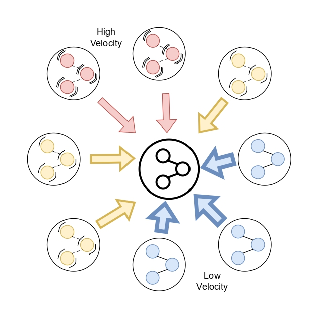

# 🧠 [MobiCom FLEdge-AI 2025] FedNeVe: Efficient Federated Model Aggregation through Neural Velocity

[](https://www.docker.com/)
[](https://developer.nvidia.com/cuda-zone)
[](https://www.python.org/downloads/release/python-388/)
[](https://pytorch.org/)
[](https://www.gnu.org/licenses/gpl-3.0)
[](https://arxiv.org/abs/xxxx.xxxxx)

This repository contains the official implementation of the paper:
> **Efficient Federated Model Aggregation through Neural Velocity**  
> *Gianluca Dalmasso, et al.*  
> [MobiCom FLEDGE-AI Workshop 2025](https://www.sigmobile.org/mobicom/2025/)  
> 📄 [[arXiv link](https://arxiv.org/abs/xxxx.xxxxx)]

---



---

## 🚀 Getting Started
You can run this project either using a Python virtual environment or a Docker container.

#### ✅ Clone the repository
```bash
git clone https://github.com/EIDOSLAB/FederatedNeVe.git
cd FederatedNeVe
```
### 🧪 Option A — Run with virtual environment (recommended for development)

#### 📦 Create virtual environment & install dependencies
> This project was developed and tested with Python 3.11 — we recommend using the same version for full compatibility and reproducibility.
```bash
# 1. Install Python 3.11 (only once)
pyenv install 3.11

# 2. Create virtual environment
pyenv virtualenv 3.11 fedneve

# 3. Activate the environment
pyenv activate fedneve

# 4. Install dependencies
pip install -r requirements.txt

# 5. From inside FederatedNeve folder install the setup.py
pip install .
```

#### 🚀 Run training
```bash
cd src
python classical.py
python federated.py
```

### 🐳 Option B — Run with Docker
You can also use Docker for full environment reproducibility.

#### 🏗️ Build Docker images and push to remote registry
The `build.sh` script automates the build of all Docker images and pushes them to the configured remote Docker registry.

Before running, make sure to edit `build.sh` to set your remote registry URL and credentials if needed.

Run:
```bash
bash build.sh
```
This will build the following Docker images:
- `fedneve:base` (default container for training and experiments)
- `fedneve:python` (base Python environment)
- `fedneve:sweep` (for hyperparameter sweep experiments)
    
#### 🚀 Run training inside the container
```bash
docker run --rm -it \
  --gpus all \                   # Optional: remove if no GPU
  neve:python federated.py  # Optional: Optional parameters...
```
> 💡 Note: you may need to adjust volume mounting (-v) depending on your OS and Docker setup.

---

## 📊 Datasets
Tested datasets:
 - CIFAR10, and CIFAR100
 - EuroSAT
 - Caltech-256
 - MNIST, and FashionMNIST
 - Imagenette (must be downloaded separately and prepared in the standard folder format.)

---

## 🪪 License
This project is licensed under the **GNU General Public License v3.0**.  
See the [LICENSE](./LICENSE) file for details.

➡️ You are free to use, modify, and distribute this code under the same license terms.  
Any derivative work must also be distributed under the GNU GPL.

---

## 🙌 Acknowledgments
This research was developed at the University of Turin (UniTO), within the [EIDOS Lab](https://www.di.unito.it/~eidos/), and University of Surrey within the [NICE](https://www.surrey.ac.uk/nature-inspired-computing-and-engineering-research-group) group.

We thank the members of both institutions for the insightful discussions and support during the development of this work.

---

## 📜 Citation
If you use this repository or find our work helpful, please cite:
(Citation will be updated upon publication)
```bibtex
@misc{dalmasso2025fedneve,
  title        = {Efficient Federated Model Aggregation through Neural Velocity},
  author       = {Dalmasso, Gianluca and Gusmão, Pedro Porto Buarque and Fiandrotti, Attilio and Grangetto, Marco},
  year         = {2025},
  howpublished = {https://arxiv.org/abs/xxxx.xxxxx},
  note         = {MobiCom FLEDGE-AI Workshop 2025. Official citation will be updated upon publication.}
}
```

---

## 📫 Contact
For questions or collaborations, feel free to reach out:
- 📧 gianluca.dalmasso@unito.it / gianluca.dalmasso@gmail.com
- 🐙 GitHub Issues for bugs or feature requests